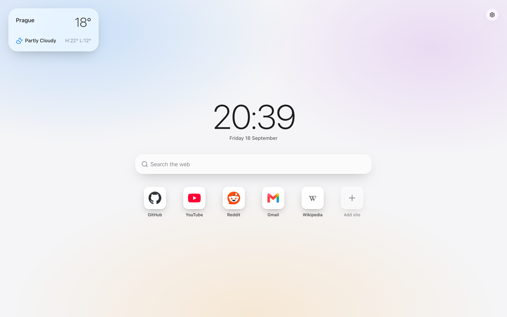
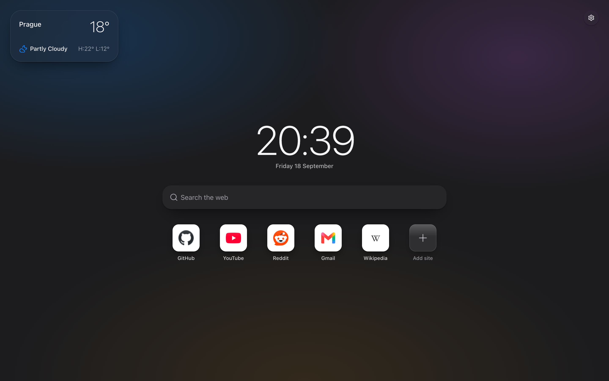

# My Homepage

A calm, Apple-style new tab page for Chromium browsers.



- Local time and date, front and centre
- Search with your preferred engine
- Favourite sites as macOS-style app icons
- Weather for your city
- Light and dark appearance, following the system by default



## Run it locally

Requires Node 24 and pnpm.

```bash
pnpm install
pnpm dev
```

Open `chrome://extensions`, turn on **Developer mode**, click **Load unpacked** and choose the
`dist/` folder. If Chrome asks whether to keep the changed new tab page, choose **Keep it**.
